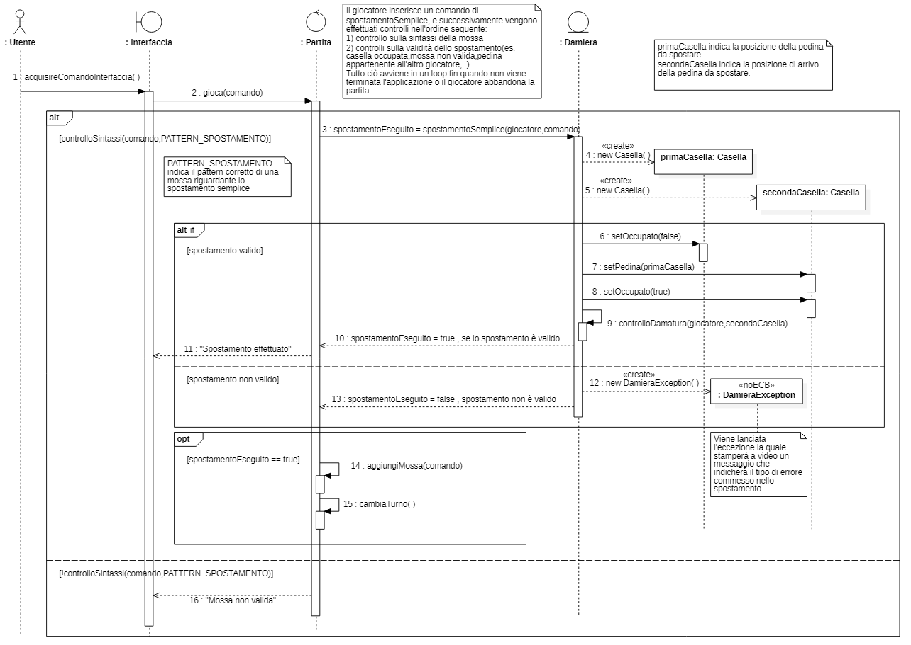

# **Relazione tecnica finale**
## Indice
#

1. [Introduzione](#Introduzione)
2. [Modello di dominio](#Modello-di-dominio)
3. [Requisiti specifici](#Requisiti-specifici)
    
    3.1[Requisiti funzionali](#Requisiti-funzionali)
    
    3.2[Requisiti non funzionali](#Requisiti-non-funzionali)
    
4. [System Design](#System-Design)
    - [Stile architetturale adottato](#Stile-architetturale-adottato)
    - [Diagramma dei package](#Diagramma-dei-package)
    - [Commenti](#Commenti)
5. [OO Design](#OO-Design)
    - [Diagrammi delle classi e diagrammi di sequenza](#Diagrammi-delle-classi-e-diagrammi-di-sequenza)
    - [Design pattern utilizzati](#Design-pattern-utilizzati)
    - [Commenti OO Design](#Commenti-OO-Design)
6. [Riepilogo dei Test](#Riepilogo-dei-Test)
    - [Tabelle riassuntive](#Tabelle-riassuntive)
7. [Manuale utente](#Manuale-Utente)
8. [Processo di sviluppo e organizzazione del lavoro](#Processo-di-sviluppo-e-organizzazione-del-lavoro)
9. [Analisi retrospettiva](#Analisi-retrospettiva)
    - [Soddisfazioni](#Soddisfazioni)
    - [Insoddisfazioni](#Insoddisfazioni)
    - [Cosa ci ha fatto impazzire](#Cosa-ci-ha-fatto-impazzire)

# Introduzione
Dama-Yourdon è un'applicazione, con interfaccia a linea di comando, che permette a due giocatori di sfidarsi localmente 
al gioco della dama. L'applicazione è stata realizzata per il corso di Ingegneria del Software dell'A.A 2020/2021 dal gruppo **_Yourdon_** i cui membri sono:

- [Francesco Ferrulli](https://github.com/Ferru2000)
- [Daniele Cecca](https://github.com/DanieleCecca)
- [Marco Angelo Lillo](https://github.com/MarcoLillx)
- [Michele Fraccalvieri](https://github.com/Citrone16)
- [Francesco Digregorio](https://github.com/FDigre)

 L'esecuzione dell'applicazione avviene a linea di comando via **Docker**.

[Torna all'indice](#Indice)
  

# Modello di dominio
Abbiamo realizzato il seguente modello di dominio per esplicitare i concetti fondamentali della nostra applicazione 
tramite un diagramma delle classi con prospettiva software.

[Torna all'indice](#Indice)
   

# Requisiti specifici
Di seguito sono riportati i requisiti funzionali disposti in ordine cronologico rispetto alla creazione degli issue, seguiti dai requisiti non funzionali.

## Requisiti funzionali

I requisiti funzionali sono i seguenti:
- ### [Help](https://github.com/softeng2021-inf-uniba/progetto2021ter-yourdon/issues/20)

    L'utente può visualizzare l'elenco dei comandi disponibili tramite il comando `help`.
    
    **Criteri di accettazione**

    Eseguendo il comando `help` o invocando l'app con flag `--help` o `-h`
    il risultato è una descrizione concisa, che normalmente appare all'avvio del programma, seguita dalla lista di comandi disponibili, uno per riga, come dal successivo esempio:

    - `gioca`
    - `esci`
    - `...`

- ### [Iniziare nuova partita](https://github.com/softeng2021-inf-uniba/progetto2021ter-yourdon/issues/23)

    L'utente può iniziare una partita tramite il comando `gioca`. Subito dopo sarà possibile inserire la prima mossa di gioco (in notazione algebrica) o inserire altri comandi; ad esempio il comando `damiera` (per mostrare la damiera).

    **Criteri di accettazione**

    Al comando `gioca` se nessuna partita è in corso l'app si predispone a ricevere la prima mossa di gioco o altri comandi.

- ### [Abbandonare partita](https://github.com/softeng2021-inf-uniba/progetto2021ter-yourdon/issues/37)

    L'utente può abbandonare la partita tramite il comando `abbandona`.
    
    **Criteri di accettazione:**
    
    Al comando `abbandona` l'app chiede conferma: 
    - se la conferma è positiva, l'app comunica che il Bianco (o Nero) ha vinto per abbandono 
    - se la conferma è negativa, l'app si predispone a ricevere nuovi comandi

- ### [Chiudere il gioco](https://github.com/softeng2021-inf-uniba/progetto2021ter-yourdon/issues/41)

    L'utente può terminare l'applicazione tramite il comando `esci`.

    **Criteri di accettazione:**
    
    Al comando `esci` l'applicazione chiede conferma:
    - se la conferma è positiva, l'app si chiude restituendo un zero exit code
    - se la conferma è negativa, l'app si predispone a ricevere nuovi comandi

- ### [Mostrare damiera con numerazione](https://github.com/softeng2021-inf-uniba/progetto2021ter-yourdon/issues/21)

    L'utente può visualizzare a schermo la damiera con la numerazione in modo da ricordare come sono numerate le caselle della damiera (tramite il comando `numeri`).

    **Criteri di accettazione**

    Al comando `numeri` l'app mostra la damiera con i numeri sulle caselle nere.
    Il formato della damiera è presente in [`Assegnazione progetto.md`](https://github.com/softeng2021-inf-uniba/progetto2021ter-yourdon/blob/master/Assegnazione%20progetto.md)

- ### [Mostrare damiera con i pezzi](https://github.com/softeng2021-inf-uniba/progetto2021ter-yourdon/issues/22)

    L'utente può visualizzare a schermo la damiera con i pezzi in modo da visualizzare lo stato del gioco (tramite il comando `damiera`).

    **Criteri di accettazione**

    Al comando `damiera`
    - se il gioco è iniziato l'app mostra la posizione di tutti pezzi sulla damiera
        - i pezzi sono mostrati [in formato Unicode](https://en.wikipedia.org/wiki/English_draughts#Unicode)
    - se il gioco non è iniziato l'app suggerisce il comando gioca

- ### [Mostrare tempo di gioco](https://github.com/softeng2021-inf-uniba/progetto2021ter-yourdon/issues/42)

    L'utente può visualizzare a schermo il tempo di gioco trascorso tramite il comando `tempo`.

    **Criteri di accettazione**

    Al comando `tempo`
    - se il gioco è in corso 
        - l'app mostra il tempo trascorso per il Bianco dall'inizio del gioco
        - l'app mostra il tempo trascorso per il Nero dall'inizio del gioco
    - se il gioco non è in corso l'app suggerisce il comando `gioca` e si predispone a ricevere nuovi comandi

- ### [Spostare una pedina con spostamento semplice](https://github.com/softeng2021-inf-uniba/progetto2021ter-yourdon/issues/28)

    L'utente può spostare una pedina mediante spostamento semplice inserendo il comando in notazione algebrica.

    **Criteri di accettazione**

    A partita in corso di gioco, l'app deve accettare mosse di spostamento semplice di pedina in notazione algebrica.
    
    Lo spostamento semplice della pedina deve rispettare le [regole del gioco](http://www.fid.it/regolamenti/capo1.htm) della dama italiana, escludendo damature e prese. In particolare (_Art. 4 - Gli spostamenti semplici_).

    La pedina può essere mossa solo in avanti e in diagonale e portata dalla casella di partenza in una casella libera contigua.

    All'immissione di una mossa valida come:
    
        Es. 1-5

    viene aggiornato lo stato della damiera, altrimenti viene visualizzato un messaggio di errore e l'app si predispone a ricevere un nuovo comando.

- ### [Spostare una pedina con presa semplice](https://github.com/softeng2021-inf-uniba/progetto2021ter-yourdon/issues/27)

    L'utente può spostare una pedina mediante presa semplice inserendo il comando in notazione algebrica.

    **Criteri di accettazione**
    
    A partita in corso di gioco, l'app deve accettare mosse di spostamento di pedina con presa semplice in notazione algebrica.

    Lo spostamento della pedina con presa semplice deve rispettare le [regole del gioco](http://www.fid.it/regolamenti/capo1.htm) della dama italiana. In particolare (_Art. 5 e 6_).
    
    All'immissione di una mossa valida come:
    
        Es. 18x11 (se è il bianco a muovere)

    viene aggiornato lo stato della damiera, altrimenti viene visualizzato un messaggio di errore e l'app si predispone a ricevere un nuovo comando.
    
- ### [Spostare una pedina con presa multipla](https://github.com/softeng2021-inf-uniba/progetto2021ter-yourdon/issues/29)

    L'utente può spostare una pedina mediante presa multipla inserendo il comando in notazione algebrica.

    **Criteri di accettazione**

    A partita in corso di gioco, l'app deve accettare mosse di spostamento di pedina con presa multipla in notazione algebrica.

    Lo spostamento della pedina con presa multipla deve rispettare le [regole del gioco](http://www.fid.it/regolamenti/capo1.htm) della dama italiana. In particolare (_Art. 5 e 6_).

    All'immissione di una mossa valida come:
    
        Es. 22x15x6 (se è il bianco a muovere)

    viene aggiornato lo stato della damiera, altrimenti viene visualizzato un messaggio di errore e l'app si predispone a ricevere un nuovo comando.

- ### [Spostare una pedina con damatura](https://github.com/softeng2021-inf-uniba/progetto2021ter-yourdon/issues/30)

    L'utente può spostare una pedina con damatura inserendo il comando in notazione algebrica.

    **Criteri di accettazione**

    A partita in corso di gioco, l'app deve accettare mosse di spostamento semplice di pedina in notazione algebrica che terminano con la damatura.
        
    Lo spostamento con damatura deve rispettare le [regole del gioco](http://www.fid.it/regolamenti/capo1.htm) della dama italiana. 

    All'immissione di una mossa valida come:
    
        Es. 6-3 oppure se c'è una presa 10x3

    viene aggiornato lo stato della damiera, altrimenti viene visualizzato un messaggio di errore e l'app si predispone a ricevere un nuovo comando.

- ### [Mostrare le prese](https://github.com/softeng2021-inf-uniba/progetto2021ter-yourdon/issues/34)

    L'utente può visualizzare le prese effettuate durante la partita tramite il comando `prese`.

    **Criteri di accettazione**
    
    Al comando `prese` l'app mostra le prese del Bianco e del Nero con caratteri Unicode
             
        Es.
            Bianco: ⛂ ⛂
            Nero: ⛀ ⛀ ⛀ ⛀

- ### [Mostrare le mosse giocate](https://github.com/softeng2021-inf-uniba/progetto2021ter-yourdon/issues/36)

    L'utente può visualizzare le mosse giocate (quindi riconosciute ed attuate dal programma), in modo da poter ripercorrere mentalmente la storia della partita giocata, tramite il comando `mosse`.

    **Criteri di accettazione**

    Al comando `mosse` l'app mostra la storia delle mosse con notazione algebrica
    
        Esempio:
            B 21-18
            N 10-14
            B 24-20
            N 14x21
            ...

[Torna all'indice](#Indice)

## Requisiti non funzionali
#

- ### **Portabilità**
    Questa applicazione è supportata da qualsiasi terminale. Tuttavia, bisogna prestare attenzione che il terminale utilizzato supporti la codifica UTF-8, per poter visualizzare correttamente le pedine e le dame:
    - terminale di Linux
    - teminale di MacOS
    - Windows Terminal/Windows Powershell
    - Git Bash (in questo caso il comando Docker ha come prefisso winpty: `winpty docker -it ...`)

- ### **Manutenibilità**
    Questo requisito non funzionale è garantito dalla _tassonomia **ECB**_ , che permette di avere un software modulare, su cui sarà più facile effettuare eventuali modifiche.

    Inoltre, un futuro intervento all'interno del codice sarà facilitato dalla presenza della documentazione generata da _Javadoc_.

- ### **Affidabilità**
    Questo requisito non funzionale è garantito dalla presenza di eccezioni che vengono lanciate e gestite all'interno dell'applicazione. Inoltre, ogni qualvolta si verifica una situazione non valida viene stampato a video un messaggio con una descrizione significativa.

- ### **Usabilità**
    Questo requisito non funzionale è garantito dalla presenza di due interfacce che contengono i comandi validi nel caso in cui la partita sia iniziata o meno.

- ### **Scalabiltà**
    Questo requisito non funzionale è garantito dalla possibilità di aggiungere nuove funzionalità (come ad esempio lo spostamento della dama) senza intervenire sui metodi già realizzati.

- ### **Efficienza**
    Questo requisito non funzionale è garantito dalla capacità del sistema di rispondere alla richiesta dell'utente in un tempo inferiore ai 3 secondi.
# System Design

## Stile architetturale adottato
Abbiamo deciso di adottare lo stile architetturale **Model-View-Controller**, separando la logica di business (Model) da quella di rappresentazione dei dati (View), attenendoci quindi alla tassonomia **Entity-Control-Boundary**.
- La parte Model viene identificata dalle classi di tipo Entity, che rappresentano il dominio dell'applicazione.
- La parte View viene identificata dalla classe Interfaccia di tipo Boundary, che si occupa delle interazioni con l'attore.
- La parte Controller viene identificata dalla classe Partita di tipo Control, che gestisce la logica di business.

## Diagramma dei package
Abbiamo realizzato il seguente diagramma dei package per esplicitare le dipendenze all'interno della nostra applicazione.

[Torna all'indice](#Indice)
   

## Commenti
Abbiamo deciso di adottare lo stile architetturale **Model-View-Controller** così da rispettare a pieno la tassonomia **Entity-Control-Boundary**, dove:
- Le classi Entity possono comunicare tra loro e con le classi Control.
- Le classi Boundary possono comunicare con l'attore e con le classi Control.
- Le classi Control possono comunicare con tutte le classi eccetto gli attori.
  

# OO Design

## Diagrammi delle classi e diagrammi di sequenza
Diagramma delle classi con prospettiva software

  

Diagramma di sequenza della user story `gioca`

  

Diagramma di sequenza della user story `damiera`

  

Diagramma di sequenza della user story `numeri`

  

Diagramma di sequenza della user story `spostamento semplice`

  

Diagramma di sequenza della user story `presa semplice`

  

## Design Pattern Utilizzati
Per quanto riguarda i design pattern, abbiamo deciso di implementare il design pattern **Singleton** per la classe Interfaccia, in quanto non è necessario avere più di una istanza delle classe Interfaccia.

## Commenti OO Design
Il diagramma delle classi con prospettiva software e i diagrammi di sequenza sono stati creati in modalità *Reverse engineering*.

Abbiamo anche pensato di implementare il design pattern **Prototype** per la classe Casella, in quanto il Prototype Pattern si utilizza solitamente quando si ha necessità di istanziare numerosi oggetti di una classe che differiscono leggermente tra loro. Nel nostro caso gli oggetti della classe Casella sarebbero potuti essere istanziati in uno dei seguenti modi:
- Casella vuota
- Casella con pedina bianca
- Casella con pedina nera
- Casella con dama bianca
- Casella con dama nera

Abbiamo deciso tuttavia di non utilizzare il design pattern Prototype perchè avremmo aumentato notevolmente la complessità dell'applicazione dando luogo all'over-engineering.
Avremmo quindi dovuto ristrutturare l'architettura dell'applicazione avendo risorse temporali limitate.

[Torna all'indice](#Indice)
  

# Riepilogo dei Test
## Tabelle riassuntive
- Tabella riassuntiva del coverage generata da JaCoCo:

 

- Il report sul numero di test eseguiti in totale:

 

- Report Coveralls

 

 

Non è stato possibile raggiungere il 100% di coverage in quanto le righe di codice non coperte richiedevano 
input multipli da parte dell'utente.

[Torna all'indice](#Indice)
  

# Manuale Utente

Per avviare l'applicazione, dopo aver avviato Docker desktop è necessario eseguire i seguenti comandi:
1. `docker pull docker.pkg.github.com/softeng2021-inf-uniba/progetto2021ter-yourdon/dama-yourdon:latest`
2. `docker run --rm -it docker.pkg.github.com/softeng2021-inf-uniba/progetto2021ter-yourdon/dama-yourdon:latest`

Questa applicazione utilizza alcuni simboli in codifica di unicode ed è necessario utilizzare uno dei seguenti terminali che supportano la codifica UTF-8:
- terminale di Linux
- teminale di MacOS
- Windows Terminal/Windows Powershell
- Git Bash (in questo caso il comando Docker ha come prefisso winpty:
`winpty docker -it ...`)

Per poter visualizzare in maniera corretta i caratteri unicode su Windows bisogna:
    
- impostare il terminale con la tabella codici scrivendo il comando " `chcp 65001` "
- utilizzare uno dei seguenti Font:
    - _"Ms Gothic"_
    - _"NSimSun"_
    - _"SimSun-ExtB"_

Avviata l'applicazione si presenterà la seguente schermata:

Come si evince dalla schermata sarà possibile eseguire i seguenti comandi:

- `help`: mostra la lista dei comandi accettati

- `gioca`: avvia una nuova partita

- `abbandona`: mostra il seguente messaggio: **"La partita non è ancora iniziata. Inserisci il comando 'gioca' per iniziare una nuova partita."**

- `esci`: chiude l'applicazione. Nel momento in cui questo comando viene invocato richiede una conferma all'utente e in caso affermativo termina l'applicazione

- `numeri`: mostra la damiera numerata, dove i numeri rappresentano le posizioni delle caselle nelle quali sarà possibile muoversi durante la partita

- `damiera`: mostra il seguente messaggio: **"La partita non è ancora iniziata. Inserisci il comando 'gioca' per iniziare una nuova partita."**

- `tempo`: mostra il seguente messaggio: **"La partita non è ancora iniziata. Inserisci il comando 'gioca' per iniziare una nuova partita."**

Una volta iniziata la nuova partita (invocando il comando `gioca`) sarà possibile eseguire i seguenti comandi:

- `help`: mostra la lista dei comandi accettati

- `abbandona`: viene chiesto al giocatore di abbandonare la partita, in caso affermativo viene assegnata la vittoria all'altro giocatore

- `esci`: chiude l'applicazione, nel momento in cui questo comando viene invocato richiede una conferma all'utente e in caso affermativo termina l'applicazione

- `numeri`: mostra la damiera numerata, dove i numeri rappresentano le posizioni delle caselle nelle quali sarà possibile muoversi durante la partita

- `damiera`: mostra la damiera nel suo stato corrente

- `tempo`: mostra il tempo di gioco dei due giocatori

- `prese`: mostra la lista delle prese dei due giocatori   

- `mosse`: mostra la lista delle mosse dei due giocatori

Per poter eseguire una mossa bisogna inserire i comandi in notazione algebrica:

- Spostamento semplice: es. `22-18`

- Presa semplice: es. `19x10`

- Presa multipla: es. `19x10x1`

Nel momento in cui si cerca di eseguire una mossa non valida vengono mostrati dei messaggi di errore con una descrizione diversa a seconda dell'errore commesso.

[Torna all'indice](#Indice)
  

# Processo di sviluppo e organizzazione del lavoro

## Processo di sviluppo

Il processo di sviluppo di questa applicazione è avvenuto in modo iterativo ed incrementale, secondo il modello Scrum che prevede un product owner il cui ruolo è stato ricoperto dal docente. Il tutto si è sviluppato in quattro Sprint separati, ciascuno dei quali avente uno Sprint Goal. 

Durante tutto il processo di sviluppo abbiamo cercato di simulare al più un reale ambiente lavorativo stabilendo degli orari di lavoro più o meno flessibili : 
- Lun e Mar dalle 17.30 alle 20.00
- Mer - Sab dalle 15.30 alle 20.00 

All'inizio di ogni giornata lavorativa è stato svolto uno scrum meeting nel quale sono stati ripartiti i vari compiti da portare a termine cercando di essere più equi possibili nella suddivisione e, inoltre, ogni componete era libero di esprimere le proprie perplessità e pensieri sul progetto.

## Piattaforma di comunicazione adottata

Per gestire la comunicazione all'interno del team abbiamo adottato la piattaforma Discord che permette di creare dei server privati all'interno dei quali è possibile gestire canali testuali e vocali differenti a seconda delle esigenze. Nel nostro caso abbiamo realizzato quattro canali testuali :
- Generale
- Note-risorse 
- Warnings
- Off-topic

e tre canali vocali che hanno facilitato il pair-programming.

## WorkFlow utilizzato

Le varie attività sono state gestite seguendo il GitHub Flow:
ogni issue è stato assegnato ad uno o più membri del team, a seconda della complessità dell'issue, che hanno lavorato su un branch per implementare cambiamenti nel software. Una volta completata la fase di sviluppo, il branch è stato pushato in remoto per permettere ad uno o più componenti del team di effettuare la fase di review ed in caso di review positiva è stato effettuato il merge sul master e il conseguente delete del branch.

## Suddivisione e revisione

Come anticipato nel paragrafo precedente per task abbastanza complesse abbiamo adottato il pair programming, usufruendo anche del servizio "Code With Me" messo a dispozione dall'ambiente di sviluppo IntelliJ. Nel caso in cui uno dei componenti del gruppo terminava le proprie tasks cercava di aiutare chi non avesse ancora completato il proprio compito. Il tutto è stato facilitato dai canali vocali separati che hanno permesso di lavorare insieme senza creare confusione. 

Per quanto riguarda le revisioni, queste sono state discusse tramite la condivisione dello schermo nel momento in cui veniva creata la pull request.

## Uso delle boards

All'interno della board, in stile _kamban_ fornita da GitHub sono stati inseriti i vari issue sulle 5 colonne:

- TO DO dove si posizionano automaticamente gli issue appena aperti
- IN PROGRESS dove si trovavano gli issue aperti sui quali qualcuno sta lavorando
- REVIEW dove si collocano gli issues da revisionare
- READY dove si posizionano gli issues che verranno revisionati dai docenti a fine sprint
- DONE dove si aggiungono gli issues portati a termine e ufficialmente chiusi

E' stata creata la board product roadmap il cui scopo è quello di mostrare il rilascio del prodotto dal backlog ai vari sprint.

[Torna all'indice](#Indice)
  

# Analisi Retrospettiva
## **Soddisfazioni**

Sicuramente è stato stimolante realizzare, per la prima volta, un progetto simulando quello che sarà un ipotetico futuro lavorativo. Per poter simulare al meglio un ambiente lavorativo abbiamo deciso di stabilire delle regole. Ogni qualvolta un membro del team non avesse rispettato una regola, nel canale "warnings" del server Discord è stato aggiunto un warning. Al termine del progetto il membro del team con il maggior numero di warnings dovrà offrire una birra a tutti.

L'utilizzo di Git e GitHub ha facilitato l'intero processo di sviluppo, rendendo più leggero il lavoro da svolgere. 

Abbiamo terminato il lavoro sempre con abbastanza anticipo, avendo così più tempo per poter revisionare il lavoro svolto.

## **Insoddisfazioni**

Ci siamo rammaricati per aver perso un punto di valutazione allo Sprint 1 per non aver inserito, per una svista del team, l'`if` che permettesse di richiamare il comando `help` in partita.

Pur essendo il gioco della Dama uno dei primi progetti per il team, è risultato abbastanza limitante come progetto, in quanto il gioco della Dama ha di per sè una complessità non molto elevata. Inoltre, il team si sarebbe aspettato di completare le user story per poter portare a termine la partita.

## **Cosa ci ha fatto impazzire**

Raggiungere la copertura del 90% non è certo risultato un compito facile, essendo il gioco della Dama un gioco che richiede numerosi input da parte dell'utente. Nonostante questo ci sentiamo soddisfatti del risultato raggiunto.

Sebbene StarUML sia un software più avanzato rispetto agli altri tool presentati a lezione, proprio per la sua complessità è stato ostico sia trovare i modelli corretti (per es: l'attore) all'interno del software sia realizzare in genere i diagrammi di sequenza. Unica pecca di StarUML è l'impossibilità di ridimensionare più di un modello, all'interno di un diagramma, contemporaneamente.

[Torna all'indice](#Indice)